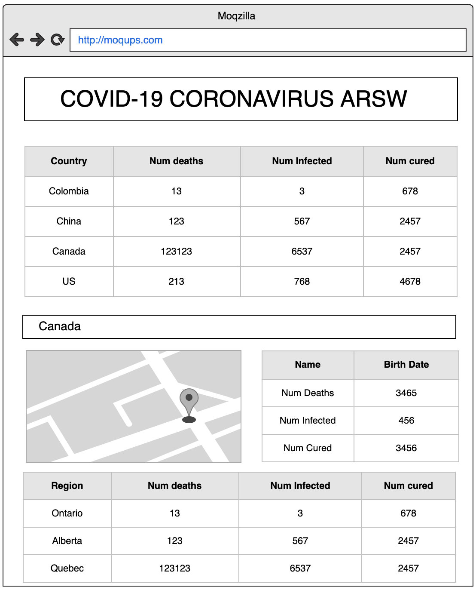

# Escuela Colombiana de Ingeniería Julio Garavito - Arquitecturas de Software ARSW - Parcial Segundo Tercio

## Autor 

-	Juan David Navarro Jimenez

## Solución

## Correr localmente

Para correr el proyecto localmente, primero hay que asegurarse de que el proyecto esta corriendo en su editor, o en consola en la carpeta raiz del proyecto con el siguiente comando:

```sh
$ mvn spring-boot:run
```

La aplicacion deberia estar corriendo en [localhost:8080](http://localhost:8080/).

## Documentacion arquitectura


Para realizar el parcial se diseñó una API la cual consume datos de una Api de RapidAPI, para esto definimos el GET para todos los países que están reportados en la API con coronavirus y un GET para buscar información de las regiones de un país.

Primero filtramos la información obtenida del API de COVID-19 Coronavirus Statistics en nuestra primera solicitud GET queremos obtener el nombre del país, cantidad de contagiados, cantidad de muertos y cantidad de personas recuperadas.

Para esto podemos consultar nuestro api en el siguiente enlace https://arsw-parcial2.herokuapp.com/stats y tendremos algunas opciones como ver todo el conjunto de datos.


O podemos ver con el formato JSON.


Para consultar nuestro api por país ingresamos en el siguiente enlace https://arsw-parcial2.herokuapp.com/stats/China y tendremos algunas opciones como ver todo el conjunto de datos.


O podemos ver con el formato JSON.


En nuestra aplicación principal que se encuentra en el siguiente enlace https://arsw-parcial2.herokuapp.com/ Damos la información de todos los países que se encuentran registrados en la API con su nombre, cantidad de contagiados, cantidad de muertos y cantidad de personas recuperadas además tendremos la opción de un botón que nos dice “Ver” el cual permite ver en detalle las regiones del país seleccionado.


### Heroku

[](https://arsw-parcial2.herokuapp.com)

**App Principal:** [`https://arsw-parcial2.herokuapp.com`](https://arsw-parcial2.herokuapp.com)

**JSON con todos los paises reportados API FindAll:** [`https://arsw-parcial2.herokuapp.com/stats`](https://arsw-parcial2.herokuapp.com/stats)

**JSON con todas las regiones de un pais reportado API FindCountry:** [`https://arsw-parcial2.herokuapp.com/stats/China`](https://arsw-parcial2.herokuapp.com/stats/China)

### Despliegue continuo (CircleCI)

[](https://circleci.com/gh/JuanNavarroJ/JUAN-NAVARRO-ARSW-T2)

## Preparación para el Parcial

Con el objetivo de preparar el examen final del segundo tercio, por favor siga las siguientes instrucciones.

1. Explore el API de COVID-19 Coronavirus Statistics en el siguiente [enlace](https://rapidapi.com/KishCom/api/covid-19-coronavirus-statistics)
2. Use la colección de Postman adjunta para validar el funcionamiento del endpoint por fuera de la página de RappidAPI.
3. Si no ha terminado por completo el último laboratorio, hagalo, si es necesario desde el inicio y completo. En ese laboratorio esta basado el parcial.
4. Revise la documentación de Google Maps para agregar marcadores a un mapa o revise este [Codepen](https://codepen.io/SitePoint/pen/YWKLzv?editors=0110)

## Descripción del Problema a Solucionar

Usted está muy preocupado por la situación sanitaria que atraviesa el mundo debido al virus COVID-19 popularmente llamado Coronavirus. Es por eso que usted decidió hacer una aplicación web informativa donde se pueda leer fácilmente información estádistica al respecto.

La aplicación mostrará inicialmente una estádistica general en la cuál se pueden listar todos los paises que presentán casos de infección confirmados, muertes y finalmente personas curadas. Esta lista deberá aparecer ordenada por los siguientes criterios:

 - Número de muertes.
 - Número de infectados.
 - Número de curados.

Adicionalmente cuando el usuario de la aplicación haga click sobre el nombre de un país determinado, usted debe mostrar la misma información (casos de infección confirmados, muertes y personas curadas) solo que en esta ocasión debe hacerlo no de manera consolidada sino que debe expandir la información por provincia. (Pruebe con China, Canada o US, países con múltiples provisncias infectadas).

Para obtener dicha información utilice el API gratuito de [COVID-19 Coronavirus Statistics](https://rapidapi.com/KishCom/api/covid-19-coronavirus-statistics) el cual usted debió estudiar previamente antes de este examen.

Se le pide que su implementación sea eficiente en cuanto a recursos así que debe implementar un caché que permita evitar hacer consultas repetidas al API externo cuando consulte las estadisticas para un país especifico.


Una vez tenga la funcionalidad básica, extienda su implementación para incluir un mapa en el cual resalte con un indicador la ubicación del país seleccionado por el usuario (revise la funcionalidad del API de mapas y el ejemplo anexo.).

Como el API del coronavirus no brinda información sobre la latitud y longitud del país consultado, apoyese en este [API](https://rapidapi.com/apilayernet/api/rest-countries-v1?endpoint=53aa5a09e4b051a76d24136a). AJUSTE LOS DIAGRAMAS DE ARQUITECTURA QUE SEAN NECESARIOS PARA REFLEJAR EL USO DE ESTE COMPONENTE.



Sugerencia realice la implementación de manera incremental. Haga commits regulares.

## Requerimientos de Arquitectura

 1. El cliente Web debe ser un cliente asíncrono que use servicios REST desplegados en Heroku y use JSON como formato para los mensajes.
 2. El servidor de Heroku servirá como un gateway para encapsular llamadas a otros servicios Web externos.
 3. La aplicación debe ser multiusuario (Sin registro y sin seguridad)
 4. Todos los protocolos de comunicación serán sobre HTTP.
 5. La interfaz gráfica del cliente debe ser los más limpia y agradable posible y debe utilizar Bootstrap. Para invocar métodos REST desde el cliente usted puede utilizar la tecnología que desee.
 6. La fachada de servicios tendrá un caché que permitirá que llamados que ya se han realizado a las implementaciones concretas con parámetros específicos no se realicen nuevamente. Puede almacenar el llamado como un String con su respectiva respuesta, y comparar el string respectivo. Recuerde que el caché es una estructura de datos. (Hashmap por ejemplo)
 7. Se debe poder extender fácilmente, por ejemplo, es fácil agregar nuevas funcionalidades, o es fácil cambiar el proveedor de una funcionalidad.
 8. Debe utilizar maven para gestionar el ciclo de vida, git y GitHub para almacenar al código fuente y Heroku como plataforma de producción.

### Diagrama de Despliegue


### Diagrama de Componentes


## Requerimientos de Entrega

1.  La aplicación funcionando en Heroku con el nombre (NOMBRE-APELLIDO-ARSW-T2) y el código fuente almacenado en un proyecto GitHub con el nombre (NOMBRE-APELLIDO-ARSW-T2).
2.  Los fuentes deben estar documentados y bien estructurados para generar el Javadoc.
3.  El README.md debe describir:
	1. El diseño de arquitectura. 
	2. La forma de ejecutar el programa localmente. 
	3. Explicar cómo se puede extender y cómo podría, por ejemplo, hacer que una función específica la implementara un proveedor de servicios diferente.
	4. Indique la urls de Heroku
    5. Indique si hizo los bonos y una evidencia de su ejecución.
4.  Suba el zip del proyecto al aula con el nombre (NOMBRE-APELLIDO-ARSW-T2).
5.  Guarde una copia de su proyecto.

> IMPORTANTE! El parcial que no sea subido a tiempo o que no cumpla al pie de la letra con las condiciones de entrega, será calificado con 0.0 sin lugar a reclamaciones, ya que las condiciones están claras.

## Criterios de Evaluación

1.  Cliente escrito en JS asíncrono invocando servicios REST (10%)
2.  Servidor fachada exponiendo servicios REST (10%)
3.  Conexión a servicios externos (10%)
4.  Cliente Java para Tests concurrentes para el servicio en Heroku y para el del proveedor externo(10%)
5.  Cache tolerante a la concurrencia y una sola instancia para la aplicación (10%)
6.  Implementa la funcionalidad de los mapas de manera asíncrona (15%)
7.  Diseño y descripción del diseño son de alta calidad (30%)
    -   Extensible
    -   Usa patrones
    -   Modular
    -   Organizado
    -   Javadoc publicado
    -   Identifica la función de componentes individuales demuestra conocimiento del funcionamiento general de la arquitectura.

## Bonos

1. Si el dato del cache tiene más de 5 min se debe solicitar nuevamente al servidor externo.
2. Poner un marcador NO solo sobre el país seleccionado, sino sobre todas las provincias infectadas de ese país.

## Ayuda

 - Inicie con la aplicación web basada en spring que le propone Heroku en su guía inicial para java. ([https://devcenter.heroku.com/articles/getting-started-with-java](https://devcenter.heroku.com/articles/getting-started-with-java))
  - Como poner marcadores en un mapa de Google Maps
 [Codepen example](https://codepen.io/SitePoint/pen/YWKLzv?editors=0110)
 - Para invocar un servicios get desde java puede hacerlo de manera fácil como muestra el siguiente código, revise la [clase de pruebas adjunto al examen](coronavirusAPITest/src/test/java/coronavirusAPITest/UnirestTest.java) para más información:
```java
    @Test
	public void shouldReturnAllCases() throws UnirestException {
		HttpResponse<JsonNode> response = Unirest
				.get("https://covid-19-coronavirus-statistics.p.rapidapi.com/v1/stats")
				.header("x-rapidapi-host", "covid-19-coronavirus-statistics.p.rapidapi.com")
				.header("x-rapidapi-key", "34f05cff54msh30ba6f36c91c183p166499jsn555917ef62b8")
				.asJson();
		
		assertNotNull(response.getBody());
		assertEquals((int)HttpStatus.SC_OK,response.getStatus());
	}
```
 - Parseo de Json
```html
<!DOCTYPE html>
<html>
<body>

<h2>Create Object from JSON String</h2>

<p id="demo"></p>

<script>
var txt = '{"name":"John", "age":30, "city":"New York"}'
var obj = JSON.parse(txt);
document.getElementById("demo").innerHTML = "name: " + obj.name + ", age: " + obj.age;
</script>

</body>
</html>
```